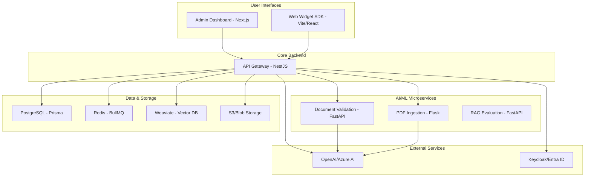

# System Overview

The Peak RAG platform is built on a modern, microservices-based architecture designed for scalability, maintainability, and extensibility. It leverages a combination of TypeScript and Python services managed within an NX monorepo.

## Core Technology Stack

- **Monorepo**: NX 20 with pnpm workspaces
- **Backend**: NestJS (Node.js) for the core API, FastAPI and Flask for Python-based AI/ML microservices.
- **Frontend**: Next.js 15 (React 19) for the admin dashboard.
- **Database**: PostgreSQL (managed by Prisma ORM) for primary data and Redis for caching and queuing.
- **Vector Store**: Weaviate for high-performance vector search.
- **Message Queue**: BullMQ for managing asynchronous jobs like document ingestion.
- **AI Providers**: Primarily OpenAI and Azure AI Services, with an extensible provider interface.

## Architectural Diagram

## Service Breakdown

### `apps/api` (NestJS)

This is the central nervous system of the platform. It serves as the primary API gateway and orchestrator for all operations.

- **Responsibilities**:
  - Handles all user authentication and authorization.
  - Manages core business logic for applications, agents, and conversations.
  - Orchestrates the RAG pipeline by coordinating with Weaviate and AI providers.
  - Consumes and processes asynchronous jobs (e.g., document processing) from the BullMQ queue.
  - Provides a GraphQL/REST API for the frontend clients.

### Python AI/ML Microservices

These services handle specialized, computationally intensive AI tasks that are often better suited to the Python ecosystem.

- **`apps/document-validation` (FastAPI)**: Receives documents and uses models (e.g., Azure Document Intelligence, GPT-4o) to perform OCR, extract structured data, and validate fields against predefined schemas.
- **`apps/pdf-ingestion-service` (Flask)**: Specializes in parsing and extracting text, tables, and images from PDF documents.
- **`apps/ragas` (FastAPI)**: Implements the RAGAs framework to provide automated, metric-driven evaluation of RAG pipeline performance.

### Data Stores

- **PostgreSQL**: The primary relational database for storing structured data like user information, application settings, agent configurations, and conversation metadata. Prisma ORM provides a type-safe interface.
- **Weaviate**: The vector database that stores document chunks and their corresponding embeddings. It is responsible for the fast and accurate similarity search required for the retrieval step in the RAG pipeline.
- **Redis**: Serves as both a cache for frequently accessed data and the backend for the BullMQ message queue, which manages background processing tasks.
- **S3-Compatible Storage**: Used for storing the original uploaded document files.

This distributed architecture allows each component to be scaled and updated independently, providing a robust and flexible foundation for the entire platform.
