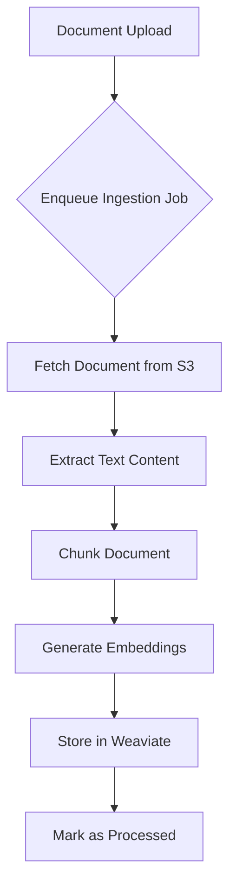
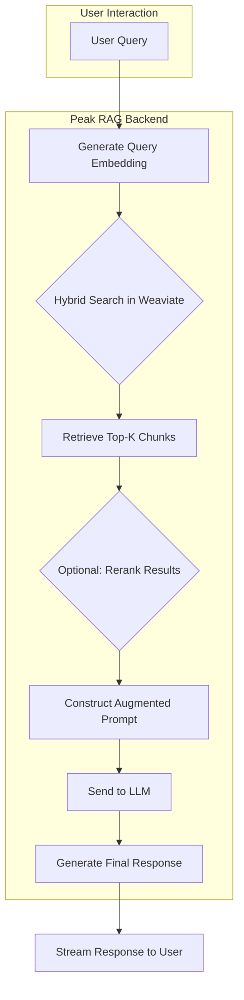

# The RAG Pipeline In-Depth

Retrieval-Augmented Generation (RAG) is the core technology that allows Peak RAG agents to answer questions based on your private data. The process can be broken down into two main phases: **Ingestion (Indexing)** and **Retrieval & Generation**.

---

## Phase 1: Ingestion Pipeline

The ingestion phase is an asynchronous process that happens when you upload new documents. Its goal is to convert your unstructured data into a structured, searchable knowledge base. This process is managed by BullMQ and orchestrated by the core API service.



1.  **Document Upload & Enqueueing**: When a file is uploaded, it is first saved to S3/Blob storage. A new job is then added to the BullMQ `ingestion` queue with the document's ID.
2.  **Text Extraction**: A worker picks up the job and retrieves the document. The system uses specialized parsers based on the file type (e.g., pdfplumber for PDFs, mammoth.js for DOCX) to extract clean text content. For images or scanned documents, an OCR service is invoked.
3.  **Chunking**: The extracted text is split into smaller, semantically meaningful segments called "chunks." This is a critical step, as the quality of the chunks directly impacts retrieval accuracy. The platform uses a recursive character text splitter, which attempts to split based on semantic boundaries (paragraphs, sentences) before falling back to a fixed size.
4.  **Embedding Generation**: Each text chunk is sent to an embedding model (e.g., `text-embedding-3-small`). The model converts the text into a high-dimensional vector (an embedding) that numerically represents its semantic meaning.
5.  **Indexing in Weaviate**: The embedding vector, the original text chunk, and associated metadata (like the source document ID) are stored as a single object in the application's dedicated Weaviate vector collection. Weaviate indexes these vectors for efficient similarity search.

---

## Phase 2: Retrieval and Generation Pipeline

This phase occurs in real-time when a user sends a query to an agent with the Knowledge Retrieval tool enabled.



1.  **Query Embedding**: The user's query is converted into an embedding using the same model that was used during ingestion. This ensures that the query and the document chunks are in the same "semantic space."
2.  **Hybrid Search**: The system performs a hybrid search in Weaviate. This combines two types of search for optimal results, using a **Relative Score Fusion** algorithm to balance the results from each:
    - **Vector (Semantic) Search**: Finds chunks that are semantically similar to the user's query.
    - **Keyword (BM25) Search**: Finds chunks that contain the exact keywords from the query.
3.  **Retrieval**: Weaviate returns the top-K most relevant chunks based on the fused hybrid search scores. The `Search Limit` parameter controls this initial retrieval count.
4.  **Reranking (Optional)**: If enabled **and hybrid search is not used**, the retrieved chunks are passed to a more sophisticated cross-encoder model. The reranker directly compares the query and each chunk to provide a more accurate relevance score, re-sorting the results. This step significantly improves signal quality but adds latency.
5.  **Prompt Augmentation**: The top-`N` reranked chunks (where `N` is the `Result Limit`) are formatted and inserted into a prompt template along with the original user query and the agent's system prompt. The final prompt looks something like this:

    ```
    System: You are a helpful AI assistant. Use the following context to answer the user's question.

    Context:
    <Chunk 1 Text>
    <Chunk 2 Text>
    ...

    User Question: <Original User Query>

    Answer:
    ```

6.  **Generation**: This augmented prompt is sent to the configured LLM (e.g., GPT-4o). The model uses the provided context to generate a factually grounded answer.
7.  **Streaming**: The response is streamed back to the user interface, providing a real-time, responsive experience.
